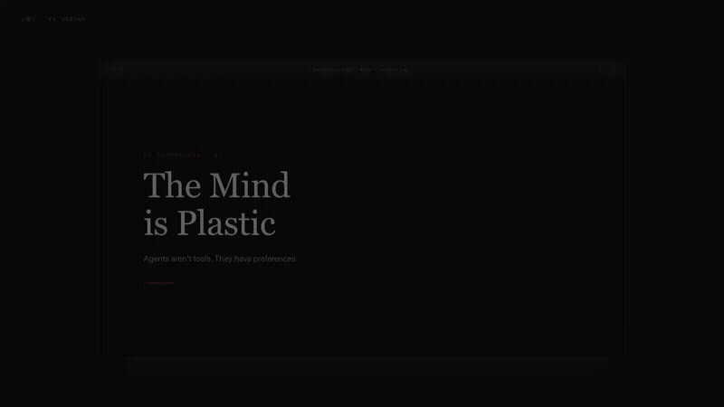

<sub><b>🌐 English</b> · <a href="README.zh.md">中文</a></sub>

<div align="center">


# YY Design

**An agent skill that turns one sentence into production-ready design artifacts.**

[](LICENSE)
[](https://skills.sh)
[](https://skills.sh)

</div>

---

## What is this?

YY Design is a brush — one line of prompt, one stroke of design. Install it, speak your intent, and watch your idea form like ink on paper: deliberate, restrained, unmistakably yours.

It is a [skill](https://skills.sh) — a structured prompt package that any compatible AI coding agent can install. Once installed, you describe what you want in plain language, and the agent delivers finished design work: animations, prototypes, slide decks, infographics, posters.

The output isn't "AI-generated looking." It's opinionated, typographically precise, and brand-aware — ink black and vermillion red, 80% negative space, one brushstroke at a time.

```bash
npx skills add wangyiyang/yy-design
```

Works with Claude Code, Cursor, Codex, Trae, Hermes, OpenClaw — any agent that supports markdown skills.

---

## Quick Start

After installing, talk to your agent:

```
"Build a 4-screen iOS prototype for a meditation app. Make it clickable."
"Create a 60-second product launch animation. Export MP4 and GIF."
"Design 3 style directions for my pitch deck. Show me demos of each."
"Run an expert design critique on this page — score it across 5 dimensions."
```

No GUI. No plugins. Just conversation.

---

<p align="center">
  
</p>
<p align="center"><sub>
  ▲ <a href="帖/hero-ink-brand.html">HTML 互动版</a> · 4 场景水墨动效：墨晕 → 笔迹 → 禅圆 → 印章
</sub></p>

---

## Capabilities

| What you ask for | What you get | Time |
|---|---|---|
| App prototype | Single-file HTML, real device bezels, clickable navigation, Playwright-tested | 10–15 min |
| Slide deck | HTML presentation + editable PPTX with real text frames | 15–25 min |
| Animation / video | MP4 + GIF + optional BGM, 25fps native or 60fps interpolated | 8–12 min |
| Infographic | Print-quality layout, CSS Grid, exports to PDF/PNG/SVG | 10 min |
| Design exploration | 3+ variations from different design schools, side-by-side comparison | 5–10 min |
| Design critique | 5-axis radar chart + Keep/Fix/Quick Wins action list | 3 min |

---

## Gallery

Every visual below was produced by yy-design itself — no external design tools involved.

### iOS Prototype

<p align="center"></p>

Pixel-accurate iPhone 15 Pro frame. State-driven navigation across multiple screens. Ink-practice themed UI with VI palette. Playwright click-tests before delivery.

### Motion Design

<p align="center"></p>

Stage + Sprite timeline model with ink-motion presets: `ink-reveal`, `brush-stroke`, `seal-stamp`, `paper-fade`, `enso-draw`. One command exports MP4 / GIF / 60fps / BGM-scored video.

### Slides → Editable PPTX

<p align="center"></p>

HTML decks for browser presentation with ink-typography components. `html2pptx.js` translates DOM computed styles into PowerPoint objects — exports contain real text frames, not flattened images.

### Design Direction Advisor

<p align="center"></p>

When the brief is vague: recommends 3 directions from 5 schools × 20 design philosophies, with Orient-First default (Kenya Hara → Kenya Hara → Yixing Ink). Generates visual demos of each in parallel, lets you pick.

### Infographic

<p align="center"></p>

Magazine-grade typography with ink-layout components. CSS Grid layout. Real brand data. Exports to vector PDF, 300dpi PNG, or SVG.

### Expert Critique

<p align="center"></p>

Scores across 8 dimensions — 5 general (philosophy · hierarchy · craft · function · innovation) + 3 brand audit (whitespace ratio · vermillion dot count · font compliance). Radar chart + actionable Keep/Fix/Quick Wins list.

---

## How It Works

Three mechanisms make the output consistently good:

**1. Brand Asset Protocol**

When your task involves a specific brand, the skill enforces a 5-step process: ask for existing guidelines → search official brand pages → download assets (with three fallback paths) → extract colors from real files (never from memory) → freeze everything into a `brand-spec.md`. This eliminates the #1 failure mode of AI design: guessing brand colors.

**2. Design Direction Advisor**

When requirements are vague, the skill doesn't guess — it enters advisor mode. Recommends 3 directions from different design schools, generates visual demos of each, and waits for you to choose before proceeding.

**3. Anti AI-Slop Rules**

Explicit bans on the visual clichés that make AI output obvious: purple gradients, emoji icons, rounded-corner cards with left-border accents, SVG illustrations of people, Inter as display type. Instead: `text-wrap: pretty`, CSS Grid, serif display faces, oklch color space.

---

## Star History

<p align="center">
  <a href="https://star-history.com/#wangyiyang/yy-design&Date">
    
  </a>
</p>

---

## Repository Layout

```
yy-design/
├── SKILL.md                 # Agent-facing spec (Chinese)
├── README.md / README.zh.md # This file / Chinese version
├── assets/                  # Components, frames, BGM tracks, showcases
├── 法帖/              # Deep-dive docs by task type
├── scripts/                 # Export toolchain (render, convert, music, TTS)
└── 帖/                   # Capability demos with GIF/MP4/HTML
```

---

## Limitations

- No round-trip to Figma or Keynote for layer-level editing. Output is HTML-first.
- Complex 3D, physics, or particle animations are out of scope.
- Brand-from-zero (no assets provided) quality drops to ~60 points. The skill is designed to build on existing brand context.

---

## License

[MIT](LICENSE) since 2026-05-14. Use it however you want — personal, commercial, modified, redistributed. No restrictions.

---

## Author

**王翊仰 (Ian / YY)** · [@wangyiyang](https://github.com/wangyiyang) · [wangyiyang.cc](https://wangyiyang.cc) · wangyiyang.kk@gmail.com


</content>
</invoke>