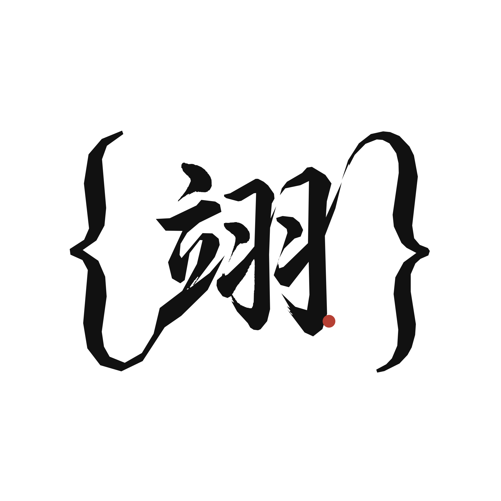

<sub>🌐 <a href="README.md">English</a> · <b>中文</b></sub>

<div align="center">



# YY Design

**一句话，让 agent 交付成品设计。**

[](LICENSE)
[](https://skills.sh)
[](https://skills.sh)

</div>

---

## 这是什么

YY Design 是一个 [skill](https://skills.sh)——装进 AI 编程 agent 里的结构化 prompt 包。装好之后，你用自然语言描述需求，agent 直接交付成品：动画视频、可点击原型、演讲 PPT、信息图、海报。

产出不是「AI 味」的东西。它有设计立场、有排印细节、能读懂你的品牌。

```bash
npx skills add wangyiyang/yy-design
```

兼容 Claude Code、Cursor、Codex、Trae、Hermes、OpenClaw——任何支持 markdown skill 的 agent。

---

## 30 秒上手

装好之后直接对 agent 说话：

```
「做个冥想 App 的 iOS 原型，4 个屏幕要能点击切换」
「把这段产品逻辑做成 60 秒动画，导出 MP4 和 GIF」
「我要做 pitch deck，给我 3 个不同风格方向的 demo」
「对这个页面做 5 维度设计评审，给我改进清单」
```

没有界面、没有插件、没有 Figma。纯对话。

---

<p align="center">
  
</p>

<p align="center"><sub>
  ▲ 这段动画本身就是 yy-design 做的 ·
  <a href="https://www.wangyiyang.cc/yy-design-hero/">HTML 互动版</a> ·
  <a href="https://github.com/wangyiyang/yy-design/releases/download/v2.0/hero-animation-v10-en.mp4">MP4 下载</a>
</sub></p>

---

## 能力一览

| 你说的 | 你拿到的 | 耗时 |
|---|---|---|
| App 原型 | 单文件 HTML，真机框，可点击导航，Playwright 自动测试 | 10–15 min |
| 演讲幻灯片 | HTML deck + 可编辑 PPTX（真文本框，不是贴图） | 15–25 min |
| 动画/视频 | MP4 + GIF + 可选 BGM，25fps 或 60fps 插帧 | 8–12 min |
| 信息图 | 印刷级排版，CSS Grid，可导 PDF/PNG/SVG | 10 min |
| 设计探索 | 3 个不同流派的方向 + 并行生成 demo 对比 | 5–10 min |
| 设计评审 | 5 维度雷达图 + Keep/Fix/Quick Wins 清单 | 3 min |

---

## 作品展示

以下每一个动画都是 yy-design 自己产出的，没有用任何外部设计工具。

### iOS 原型

<p align="center"></p>

像素级 iPhone 15 Pro 机身。状态驱动的多屏导航。真实图片来源。Playwright 自动点击测试。

### 动画引擎

<p align="center"></p>

Stage + Sprite 时间片段模型。`useTime` / `useSprite` / `interpolate` / `Easing` 四个 API 覆盖所有动画场景。一条命令导出 MP4 / GIF / 60fps / 带 BGM 成片。

### 幻灯片 → 可编辑 PPTX

<p align="center"></p>

HTML deck 浏览器演讲。`html2pptx.js` 读 DOM computedStyle 逐元素翻译成 PowerPoint 对象——导出的是真文本框，不是贴图。

### 设计方向顾问

<p align="center"></p>

需求模糊时不硬猜：从 5 流派 × 20 种设计哲学里推荐 3 个方向，并行生成 demo，让你选。

### 信息图

<p align="center"></p>

杂志级排版。CSS Grid 精准分栏。真数据驱动。可导矢量 PDF / 300dpi PNG / SVG。

### 专家评审

<p align="center"></p>

哲学一致性 · 视觉层级 · 细节执行 · 功能性 · 创新性，各 0–10 分。雷达图 + Keep/Fix/Quick Wins 清单。

---

## 工作原理

三个机制让产出质量稳定：

**1. 品牌资产协议**

涉及具体品牌时强制执行 5 步：问用户要现有素材 → 搜官方品牌页 → 下载资产（三条兜底路径）→ 从真实文件提取色值（绝不凭记忆猜）→ 固化为 `brand-spec.md`。消灭 AI 设计的头号失败模式：猜品牌色。

**2. 设计方向顾问**

需求模糊时不硬猜——进入顾问模式。从不同设计流派推荐 3 个方向，并行生成 demo，等你选定再动手。

**3. 反 AI slop 规则**

明确禁止让 AI 产出一眼假的视觉套路：紫渐变、emoji 图标、圆角卡片+左 border、SVG 画人、Inter 做标题。替代方案：`text-wrap: pretty`、CSS Grid、衬线 display 字体、oklch 色彩空间。

---

## Star 趋势

<p align="center">
  <a href="https://star-history.com/#wangyiyang/yy-design&Date">
    
  </a>
</p>

---

## 仓库结构

```
yy-design/
├── SKILL.md                 # agent 读的主文档
├── README.md / README.zh.md # 英文/中文说明
├── assets/                  # 组件、设备框、BGM、预制样例
├── references/              # 按任务类型的深入文档
├── scripts/                 # 导出工具链（渲染、转码、配乐、TTS）
└── demos/                   # 能力演示 GIF/MP4/HTML
```

---

## 局限

- 不能导出到 Figma/Keynote 做图层级编辑。产出以 HTML 为主。
- 复杂 3D、物理模拟、粒子系统超出边界。
- 没有品牌素材从零设计，质量会掉到 ~60 分。skill 设计上就是要基于已有品牌上下文工作。

---

## 协议

[MIT](LICENSE)，2026-05-14 起生效。个人、商用、修改、再分发，随意。

---

## 作者

**王翊仰 (Ian / YY)** · [@wangyiyang](https://github.com/wangyiyang) · [wangyiyang.cc](https://wangyiyang.cc) · wangyiyang.kk@gmail.com


