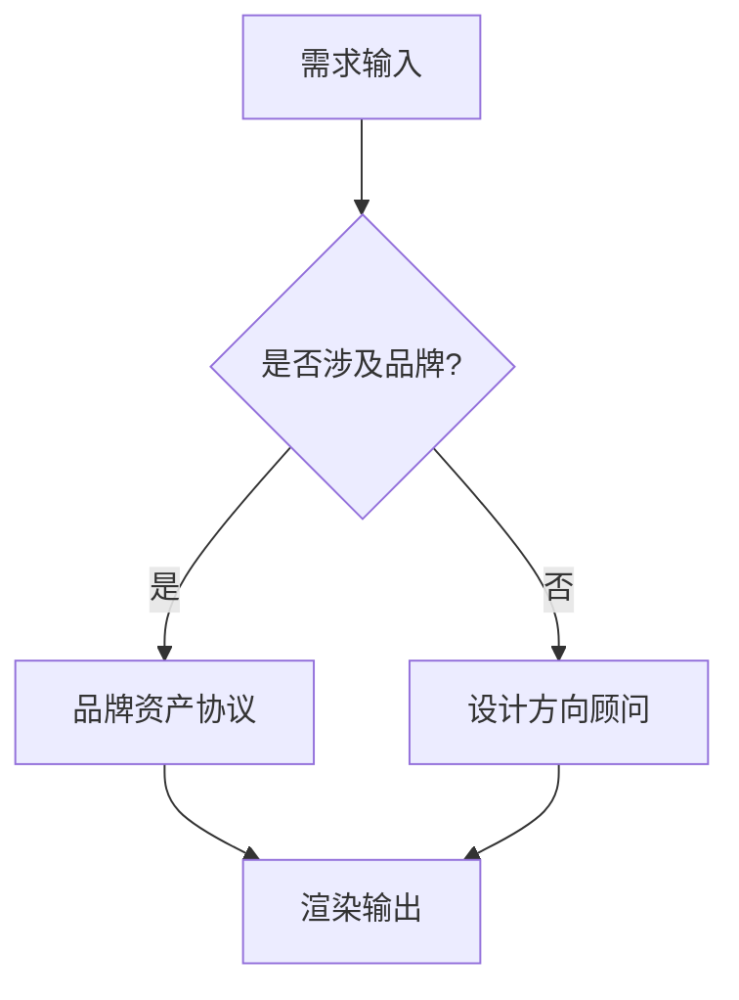

# 翊行代码 · 从零设计一套品牌 VI

**副标题**：墨黑配朱红，留白即呼吸

> 品牌的本质是「它被认出来」。
> 认出来靠什么？按识别度排序：Logo > 产品图 > UI 截图 > 色值 > 字体。

## 颜色系统

翊行代码只用四种颜色，不多不少：

- **墨黑** `#0A0A0A` — 正文、标题、代码字
- **宣白** `#FAFAFA` — 代码块字色 / 轻底
- **朱红** `#C0392B` — 链接、小标题前缀、引用竖线
- **哑金** `#B8860B` — 屏幕端基本不用，印刷场景 accent

中间灰通过墨黑透明度实现：`rgba(10,10,10,0.6)` 用于副标题，`rgba(10,10,10,0.5)` 用于 caption，`rgba(10,10,10,0.1)` 用于浅底。

## 排版系统

字体栈分三套：

- **宋体栈**：`'Source Han Serif SC','Songti SC',serif` — 标题 / 小标题
- **黑体栈**：`'Source Han Sans SC','PingFang SC',sans-serif` — 正文 / 副标题
- **等宽栈**：`'JetBrains Mono','SF Mono',monospace` — 代码

字号：H1 32px / H2 24px / H3 20px / 正文 16px / 小字 14px / caption 12px。

行高：正文 1.8，标题 1.3，代码 1.5。

## 代码示例

```javascript
const VI = {
  colors: {
    sumiBlack: '#0A0A0A',
    washiWhite: '#FAFAFA',
    vermillion: '#C0392B',
    mutedGold: '#B8860B',
  },
  fonts: {
    serif: "'Source Han Serif SC','Songti SC',serif",
    sans: "'Source Han Sans SC','PingFang SC',sans-serif",
    mono: "'JetBrains Mono','SF Mono',monospace",
  },
};
```

## 数学公式

品牌设计中的黄金比例可以用数学表达：

$$\phi = \frac{1 + \sqrt{5}}{2} \approx 1.618$$

行内公式示例：留白比例遵循 $\frac{\phi - 1}{\phi} \approx 0.618$，即 61.8% 的留白。

## Mermaid 流程图



## 引用规范

> 简单 + 神秘
>
> 要的是墨家的「气」——克制、安静、若有若无——而不是手里剑、墨家头巾这些「形」。

## 列表示例

- 先找真图，不是 placeholder 摆着
- 给 variations，不给「最终答案」
- Placeholder > 烂实现
- 系统优先，不要填充

## 结论

翊行代码的 VI 设计遵循一个核心原则：**简单 + 神秘**。所有设计元素都服务于这个原则——墨黑是神秘，朱红是克制中的点睛，留白是呼吸。

---

**参考**：
- [翊行代码官网](https://wangyiyang.cc)
- [GitHub 仓库](https://github.com/wangyiyang)
